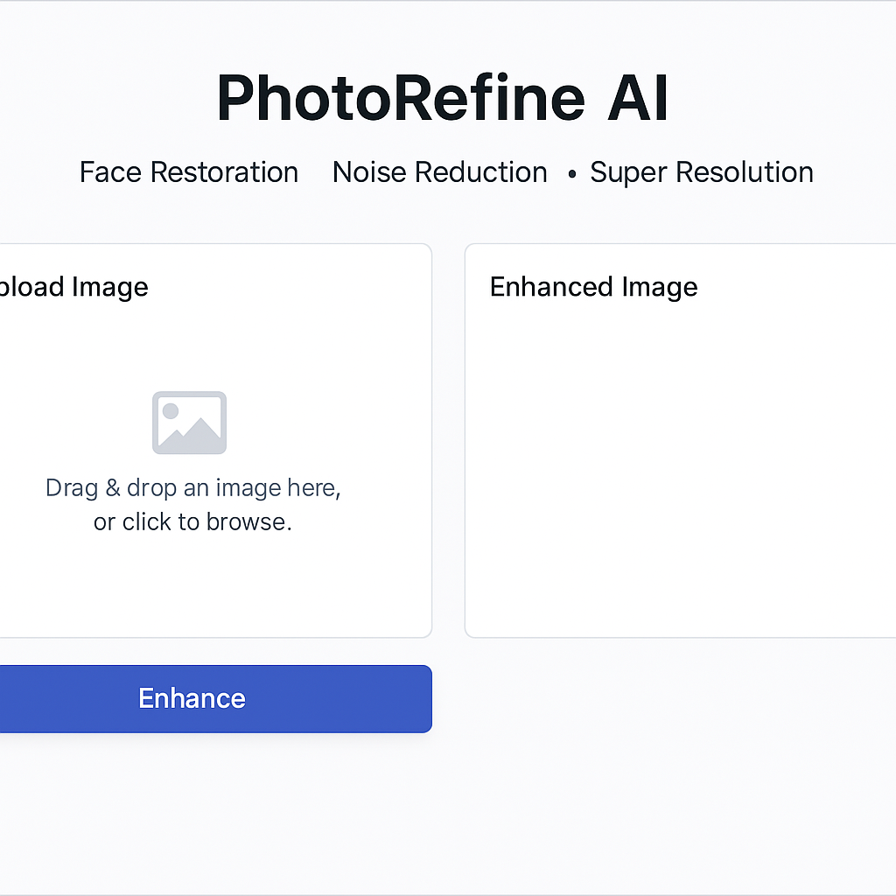
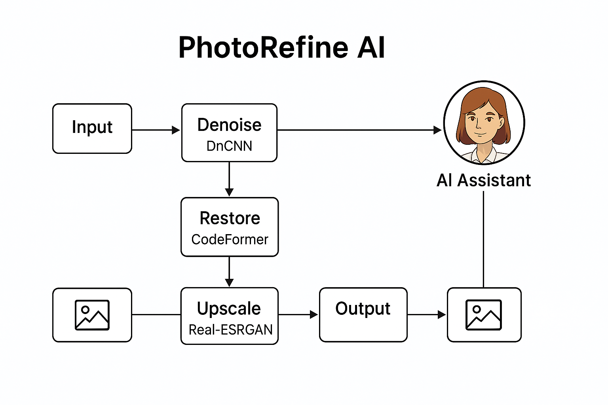
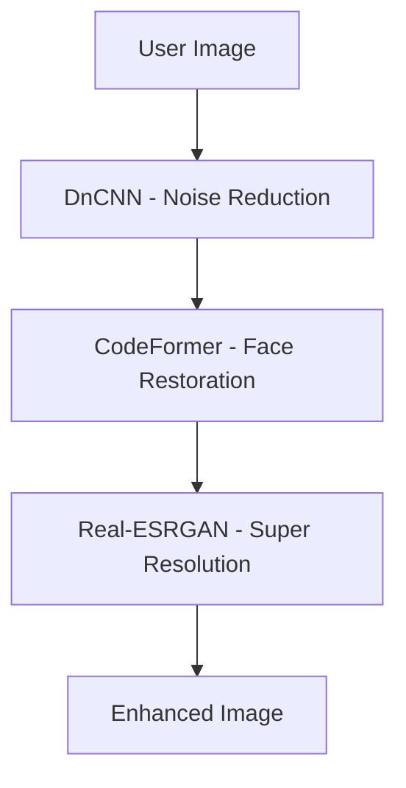

# PhotoRefine AI ✨🖼️



*Simple and intuitive interface of PhotoRefine AI*

**PhotoRefine AI** is an advanced, modular image restoration tool built using real AI models like **CodeFormer**, **Real-ESRGAN**, and **DnCNN**.  
It’s designed to **restore**, **enhance**, and **transform** photos while preserving the original facial details, giving users both power and ease.

This project was developed as part of my experimentation in building **agentic AI systems** — where multiple specialized models (agents) work together seamlessly in a single workflow.

---

## 💡 Key Features

- ✅ **Face Restoration** with CodeFormer  
- ✅ **Noise Reduction** using DnCNN  
- ✅ **Super Resolution** with Real-ESRGAN  
- ✅ **Responsive Gradio UI**  
- ✅ **Built-in AI Assistant (Rosie)**  
- ✅ **Designed for extensibility** (easy to plug new models)

---

## 🧠 Architecture

Each model runs as a separate agent with a standardized interface.  
The backend handles orchestration, validation, and fallback logic — ensuring smooth output even if one model fails.




---

## 🖥️ Demo (Coming Soon)

For now, run it locally:

```bash
git clone https://github.com/haidizedan/photo-refine-ai.git
cd photo-refine-ai
pip install -r requirements.txt
python app.py
```

Make sure to place weights for:
- `Real-ESRGAN` in `weights/`
- `CodeFormer` in `CodeFormer/weights/`
- (Optional) FaceXLib detection model

---

## 📁 Folder Structure

```bash
photo-refine-ai/
│
├── app.py                  # Gradio UI & orchestration
├── core/                   # Backends for each model
│   ├── codeformer_backend.py
│   ├── esrgan_backend.py
│   └── dncnn_backend.py
├── assets/                 # Rosie avatar, logo, sample images
├── CodeFormer/             # Submodule with official code
└── README.md               # This file
```

---

## 🧩 Built With

- Python
- Gradio
- CodeFormer (by Tencent ARC)
- Real-ESRGAN
- DnCNN
- FaceXLib

---

## 👩‍💻 Created By

**Haidi Zedan**  
AI Workflow Engineer & Prompt Architect  

---

## 👩‍💻 Created By

**Haidi Zedan**  
AI Workflow Engineer & Prompt Architect  
